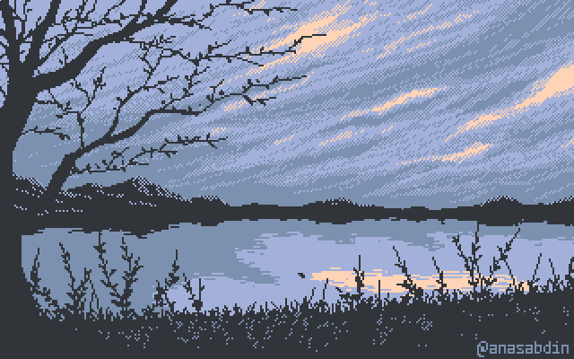

<!--Social-->
<h2 align="center"><em>Social</em></h2>

    
    
    
    

 

<!--About me-->
<h2 align="center"><em>About  me </em></h2>

  

  Hi! <b><em>I'm Emma,</em></b> an IT student diving deep into software developing.   
  I like all about technology and enjoy building small projects that let me experiment with code, design and creativity.

 

      <em><b> Studying at Higher Institute of Technological Studies (ISETB)</b></em>  
      <em><b>Interested in painting and technology</b></em> 

 
 
<!--Tools-->
<h2 align="center"> <em> Technologies </em> </h2>

  
  
  
  
  
  
  
  
  
  
  

 

<h2 align="center"> <em> Stats </em> </h2>

<!-- Proudly created with GPRM ( https://gprm.itsvg.in ) -->
